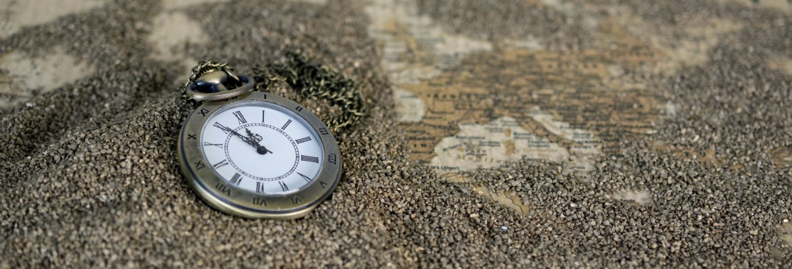
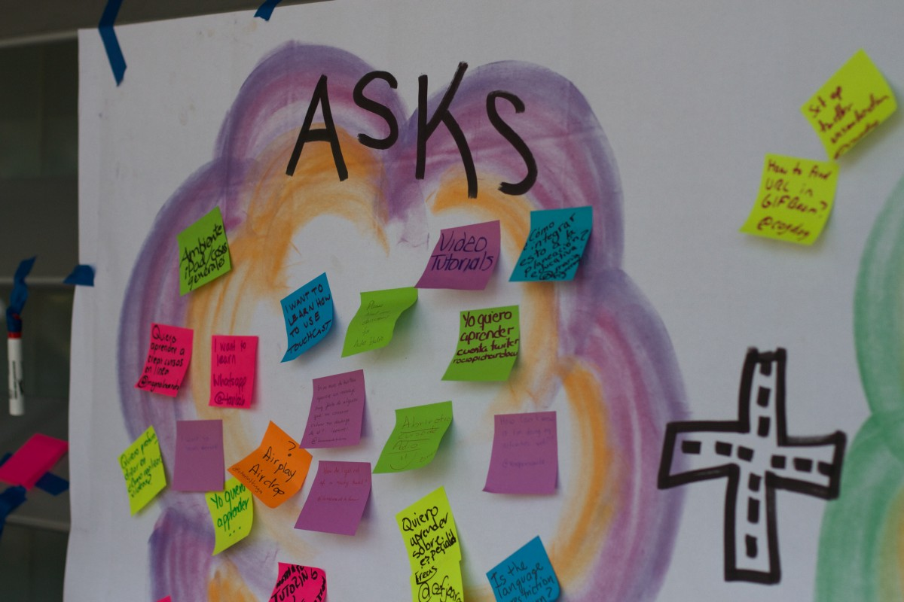
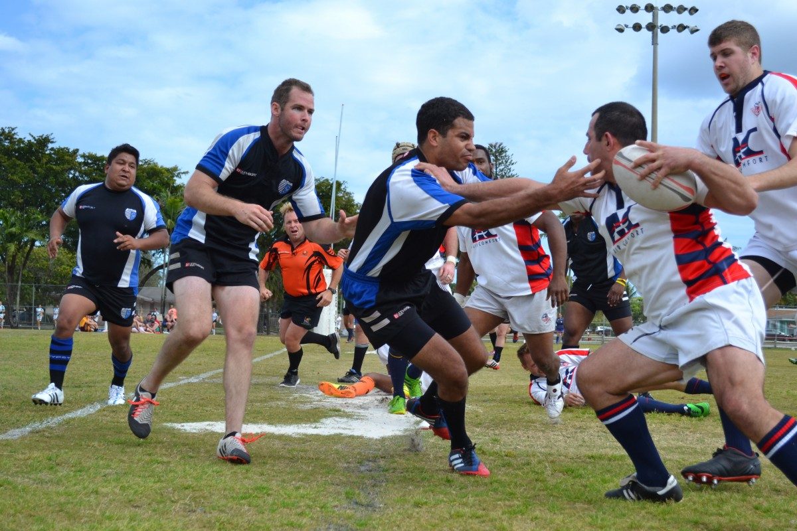
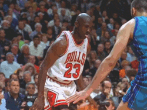
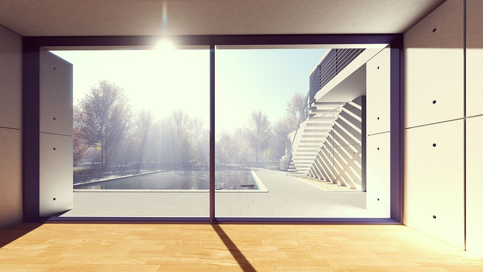
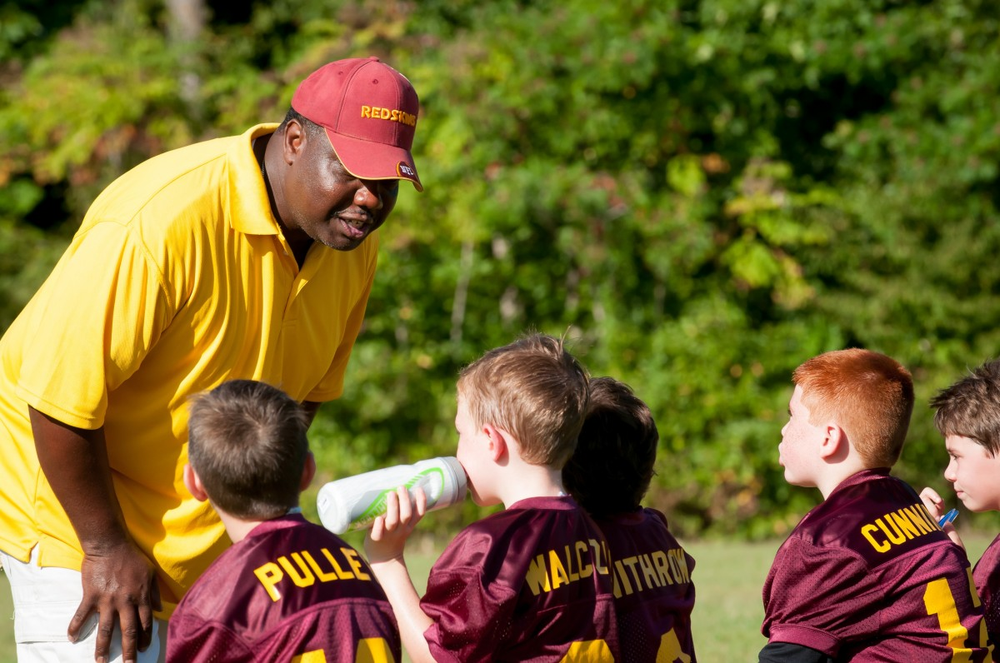
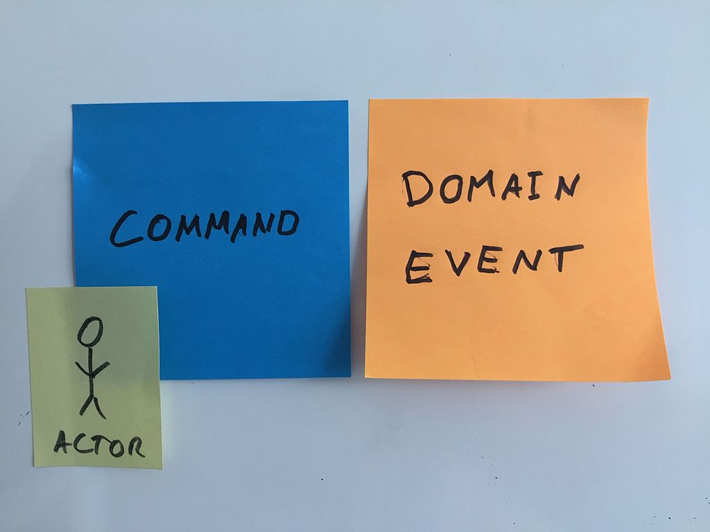
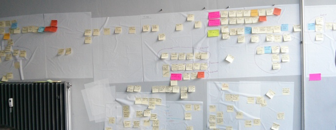
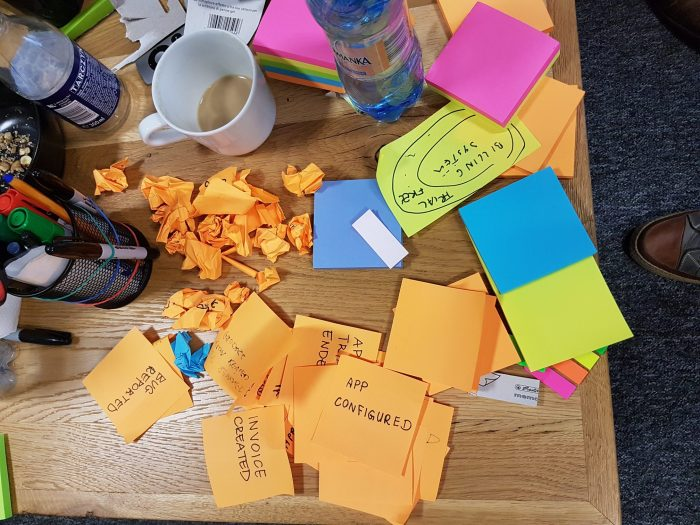

# Event Storming

*Jordi Pujol Ahulló* | [@jpahullo](http://twitter.com/jpahullo) | Working at [URV - SREd](http://www.sre.urv.cat)

[@tgndevs](http://twitter.com/tgndevs) | [Meetup](https://www.meetup.com/Tarragona-Developers-Meetup) 

----

# Why
# Event Storming?

----

# Product Requirements

---

Assume you have to build a new software

---

How do you collect the requirements?

---

How long it takes? Weeks? Months?

---

What if #?&ÑqwY%$"@ ?

---

Surrounding a table?

---

Dealing with personal positions?

----

# Key question

---

Collecting and building a set of requirements 
is a **learning process**?

---

"Children learn as they play. 
Most importantly, in play children 
learn how to learn."  
<a href="http://parentingthegods.com/o-fred-donaldson-original-play-ultimate-grace/" target="_blank">O. Fred Donaldson</a>

---

# "Let's Play!"

 

---

## Set the requirements
# in hours 
## instead of months

----

## Let's do
# event storming

----

## Personal Disclaimer

* I'm a newbie
* I'll do my best

----

## The beginnings

1. Alberto Brandolini <a href="https://twitter.com/ziobrando">@ziobrando</a>
1. <a href="http://ziobrando.blogspot.com.es/search/label/EventStorming">Event Storming appeared as such on 2013</a>
1. Book on leanpub: <a href="http://eventstorming.com/">EventStorming</a>
1. Coaching on <a href="https://www.avanscoperta.it/en/">Avanscoperta</a>
1. Before: event-driven modeling

----

## Content Disclaimer

* Information here is from public domain
* Some focus or approach here is particular to our own experience
* Focus of this job: introductory but ready to apply (please!)
* Images from public domain are linked to the site.

----

# Are you ready?

----

# Methodology

---

## Change in mindset

---

## Focus on events and business process
### ~~not in data~~

---

## Based on stickers

* Tactile 
* For taking decisions
* Fast and cheap

---

## Participants are key

* Ubiquitous language
* Focus on Core Domain
* They WILL learn
* Quick reaction to
    * Misunderstandings
    * Doubts
    * Problems

---

## Versatile

* Big picture
* Design-level modeling

---

## Timing

* 2-3 hour sessions
* Sleep & Relax
* Repeat first step

---

## Translatable

... into DDD

... to source code

----

# Ingredients

---

Room: with big wall and paper roll

---

Stickers of different colours

---

Markers, one for each participant

---

_**Key people**_: Domain experts & Developers & ...

---

Facilitator: referee + coach role

----

# Steps for event storming

---

## Preparing things and people

1. Prepare the room (preferably empty room)
1. Put the paper roll fixed on the wall: 20-30 minutes
1. Give a pen to every participant: 5-10 minutes
1. Introduce the "game rules": 15-25 minutes

---

Let's play!

----

## Introduce
# simple,
# game rules

---

Stickers and colours

---

* orange: domain events; in past participle tense
* light blue: commands; before domain events; imperative tense

---

But there are more colours ;-)

* purple/red: problem; describe it
* lilac: Process to execute after an event
* pink: External systems / Bounded context name
* green: user view (drawings)
* pale yellow: entity/aggregate; a noun

---

Working in rounds (pomodoro style)

---

Prevent* long-term discussions

----

# Phases

Generic recommendation path

Based on <a href="https://www.pearson.com/us/higher-education/program/Vernon-Domain-Driven-Design-Distilled/PGM332632.html" target="_blank">Domain-Driven Design Distilled, Chapter 7: Acceleration and Management Tools, Vaughn Vernon</a>

---

## Divide and conquer

First conquer, then divide

---

## Flood with domain events

* Paper roll = "infinite" timeline
* From left to right = precedence
* Vertical placement = parallelism

---

## Commands and Processes

* **Commands** causes the existing events
* **Processes** to run due to:
   * an event exists
   * a command was run

* A **process** starts other(s) **commands** 

Generic timeline: Command / Event / Process

---

## Which aggregates?

On top of every pair Command / Event

place the pale yellow sticky note with the

Aggregate (or Entity) 

---

## Boundaries

Outline the boundaries + pink sticky note

---

## Define views and roles

Draw in green sticky notes the **views**. The information necessary
for the user to take a decision.

Draw in small sticky notes the **role** of the user running a **command**.

---

## Results

The force side

---

The dark side of the force

----

# As a participant

Let's keep ... !

* Open-minded
* Focused
* Analytical
* Deliberative
* Proactive

---

# As a participant

You will learn! 100% sure!

----

# As a facilitator

* Hard worker

---

# The facilitator

* Who? Anyone (What? *)
    * Self-learned (make retrospective meetings)
    * Taught on facilitating event storming
* Expert on the domain? 
    * Not necessary to know anything about the context

---

## Facilitator tasks (1/3)

Make the learning process work

First conquer, then divide

---

## Facilitator tasks (2/3)

Manage time!

25 minutes for play
5 minutes for retrospective

---

## Facilitator tasks (3/3)

Make participants keeping ...!

* Focused
* Analytical
* Deliberative
* Proactive

----

## Tips for facilitators

---

When discussions appear among participants:

* Let them time for a while, consider productivity
* No more than 5-10 minutes a group discussing
* A blocking discussion? 
   * Stop it!
   * Delegate a proposal on a participant
   * Propose divide the problem being discussed
* Knowledge-building discussion?
   * It's OK!

---

Look at body language. Promote active attitude.

* Motivate opening new kind of events
* Motivate diving into a part of the problem
* Make them think about events time line
* Sitting down is not a problem. Changing viewpoint?

Keep ALL participants in play

---

Make questions

Do not give solutions

---

Implicit knowledge have to be **explicit**

---

Focus on the core of the problem 

(your domain on DDD)

---

Build an ubiquitous language (DDD)

----

# Relationships with...

**DDD**: Domain-Driven Desing

**CQRS / ES**: Command Query Responsibility Segregation/Event Sourcing

----

# More resources

* http://ziobrando.blogspot.com.es/2013/11/introducing-event-storming.html
* https://github.com/mariuszgil/awesome-eventstorming
* https://techbeacon.com/introduction-event-storming-easy-way-achieve-domain-driven-design

---

* http://verraes.net/2014/07/event-storming-fake-domains-happy-paths/
* http://verraes.net/2013/08/facilitating-event-storming/
* http://verraes.net/2015/03/event-storming-storytelling-visualisations/

---

* http://sch3lp.github.io/2014/07/12/event-storming-exercise/
* https://developer.procurios.com/post/2016/08/25/Three-event-storming-workshops-a-report
* http://tpierrain.blogspot.com.es/2015/08/event-storming-domain-distillation.html?m=1
* https://es.slideshare.net/mobile/jeppec/event-storming-48594742
* https://blog.redelastic.com/corporate-arts-crafts-modelling-reactive-systems-with-event-storming-73c6236f5dd7

----

# Conclusion

1. Collecting requirements
1. Traditional way vs innovative event storming
1. Event storming rules
1. Participant: How to attend to a session
1. Facilitator: How to manage a session

----

# Thanks!

Special thanks to **SREd**

*Jordi Pujol Ahulló* | [@jpahullo](http://twitter.com/jpahullo) | Working at [URV - SREd](http://www.sre.urv.cat)

http://jpahullo.github.io/slides/eventstorming/
