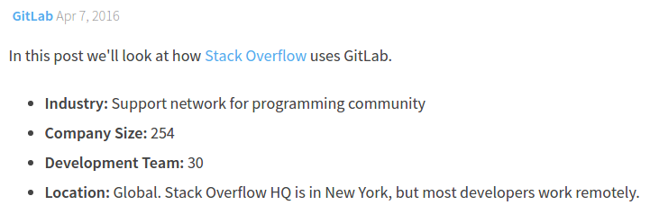
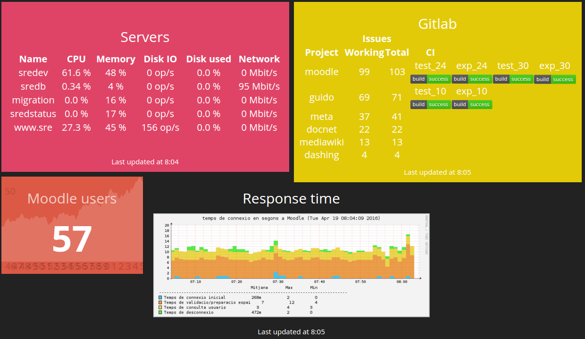

# Gitlab

by *Jordi Pujol Ahulló* 

[@jpahullo](http://twitter.com/jpahullo) | Working at [URV - SREd](http://www.sre.urv.cat)

Presented on [Meetup's 2016-04-20](http://www.meetup.com/Tarragona-Developers-Meetup/events/229781981/)

[@tgndevs](http://twitter.com/tgndevs) | [Tarragona Developers Meetup](http://www.meetup.com/Tarragona-Developers-Meetup/) 

----

# Why Gitlab?

Former project managers:
* [Bugzilla](https://www.bugzilla.org/) - used at SREd prior my arrival.
* [Redmine](http://www.redmine.org/):
 * Good experience
 * Project management: wikis, issues, labels, issue's status

But, by 2013 we were needing more:

### continuous integration!

---

# But... wait!

Only you at URV - SREd?

---

# But... wait!

Only you at URV - SREd?

Nope... [Stack Overflow also uses Gitlab](https://about.gitlab.com/2016/04/07/stack-overflow-support-network/)



----

## Gitlab: Project manager

*Everything starts with an issue*

---

## Under the hood

GitLab is a Ruby on Rails application that runs on the following software:

* Ubuntu/Debian/CentOS/RHEL
* Ruby (MRI) 2.1
* Git 2.7.4+
* Redis 2.8+
* MySQL or PostgreSQL

---

## gitlab.com for free 

- unlimited public projects
- unlimited private projects

---

## Community Edition (CE)

- Totally free
- No restrictions (10.000 projects)
- Not all features available

---

## Enterprise Edition (EE)

- gitlab.com version
- payment version
- full-featured

----

# Installation

- From source code
- From .deb .pkg packages
- From docker image

----

# Community Edition

Project options


---

## Project settings


---

### Other integrable services


---

### Other integrable services (II)


---

### DIY

http://doc.gitlab.com/ce/api/

```
curl --header "PRIVATE-TOKEN: 9koXpg98eAheJpvBs5tK" \
    "https://my.gitlab/api/v3/projects"
```

```
curl https://my.gitlab/api/v3/user?access_token=OAUTH-TOKEN
```

Or use a ruby gem [gitlab - Dec 2015](https://rubygems.org/gems/gitlab/versions/3.6.1) | [github](https://github.com/NARKOZ/gitlab)

;-)

----

## Merge requests are powerful


---

### Discussion section

* For any comment on the `Changes` section, **ideal for peer-review**
* Any push on the source branch is also presented
* General comments


---

### Commits on the merge request


---

### Builds on the merge request


With code coverage if enabled!

---

### Presenting code differences


----

# But only a project manager?

----

# Continuous Integration

- Gitlab CI integrated with Gitlab
- Per project
- Every push\* produces a build

http://doc.gitlab.com/ce/ci/README.html

---

## List of builds


---

## A single build


---

## A merge request


---

## Enabling code coverage


----

# But... How?

A simple keyword

## runners

---

## A runner is

- a Gitlab's [registered client](http://doc.gitlab.com/ce/ci/runners/README.html)
- [installed on any computer](https://gitlab.com/gitlab-org/gitlab-ci-multi-runner/#install-gitlab-runner)


---

## A runner waits for

- requests from Gitlab to run tasks
 * unitary tests
 * integration tests
 * ...
 * whatever defined in *.gitlab-ci.yml* file.

---

## .gitlab-ci.yml

```
# This file is generated by GitLab CI
Moodle CI Test:
  script:
  - composer self-update
  - composer install
  - ./vendor/bin/phpunit -c tests/ --coverage-text --colors=never
  tags:
  except:
  - tags
```

Features:
* Different build tasks for different code versions
* Stages (dev, pre-prod, prod)
* Different tasks/tests/actions per stage

---

### Runners are integrated from Gitlab

- Gitlab shows whether it was ok
- Rerun build on demand
- Depicts which computer is committing the build


---

## When installing a runner

You decide the execution type of builds

- shell
- docker
- docker-ssh
- ssh

---

## Runner types

### Shared

- Proceeding builds from any project (default)
- Tags to describe requirements (project vs. runner tags)

### Specific

- You manually assign runners to projects

----

Overall status on http://shopify.github.io/dashing/



----

# Demo time!

Note:
- docker start gitlab
- root / 5iveL!fe
- git clone ssh://git@192.168.1.2:8022/root/demo.git

----

# So...

1. **Gitlab** as a project manager (Gitlab + Gitlab CI)
2. With **continuous integration** (spotted everywhere)
3. Connected to **runners** to do automated tasks execution

----

# Thanks!

[@jpahullo](http://twitter.com/jpahullo/)

http://jpahullo.github.io/slides/gitlab/
