# Gitlab

by *Jordi Pujol Ahulló* 

[@jpahullo](http://twitter.com/jpahullo)

Presented on [2016-04-20](http://www.meetup.com/Tarragona-Developers-Meetup/events/229781981/)

[Tarragona Developers Meetup](http://www.meetup.com/Tarragona-Developers-Meetup/) 

[@tgndevs](http://twitter.com/tgndevs)

----

## Project manager

*Everything starts with an issue*

---

## gitlab.com for free 

- unlimited public projects
- unlimited private projects

---

## Community Edition (CE)

- Totally free
- No restrictions
- Not all features available

---

## Enterprise Edition (EE)

- gitlab.com version
- payment version
- full-featured

----

# Installation

- From source code
- From .deb .pkg packages
- From docker image

----

# Community Edition

Project options

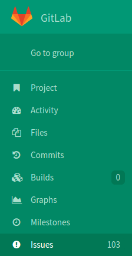
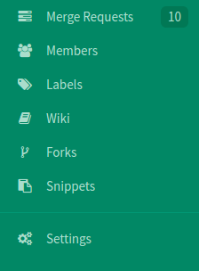

---

## Project settings

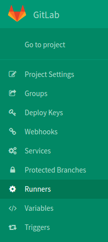

---

### Other integrable services

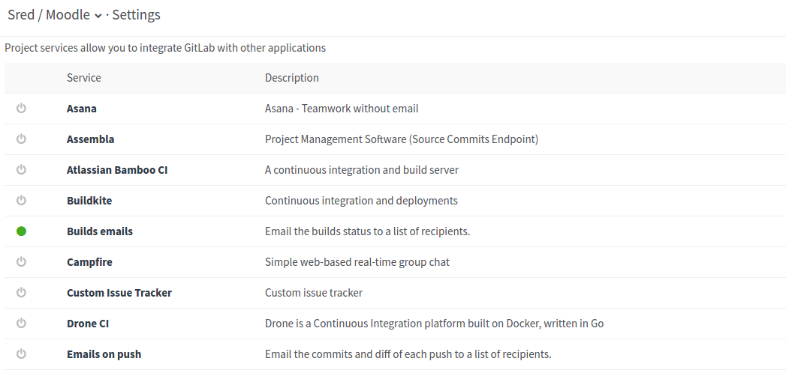

---

### Other integrable services (II)

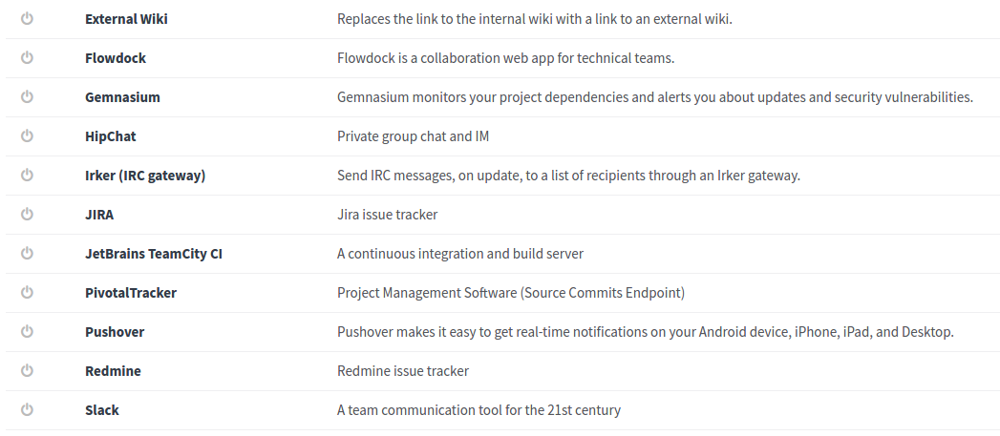

----

## Merge requests are powerful

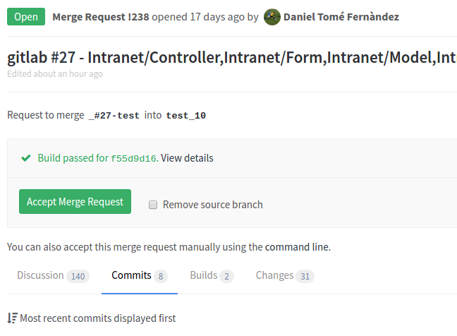

---

### Discussion section

* For any comment on the `Changes` section, **ideal for peer-review**
* Any push on the source branch is also presented
* General comments

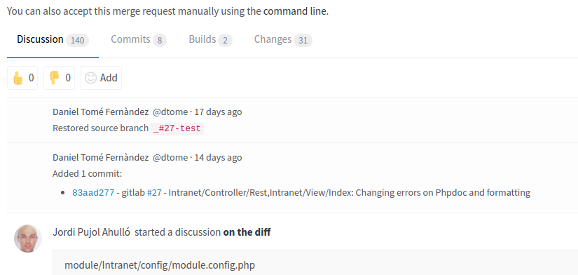

---

### Commits on the merge request

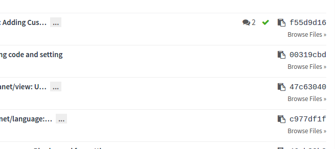

---

### Builds on the merge request

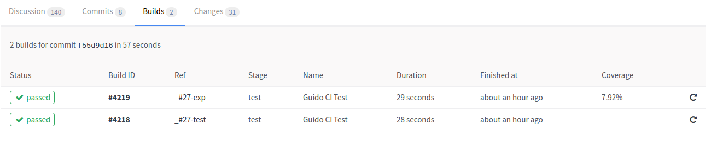

With code coverage if enabled!

---

### Presenting code differences

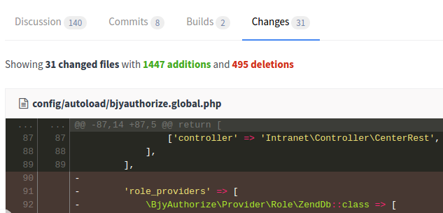

----

# But only a project manager?

----

# Continuous Integration

- Gitlab CI integrated with Gitlab
- Per project
- Every push\* produces a build

http://doc.gitlab.com/ce/ci/README.html

---

## List of builds

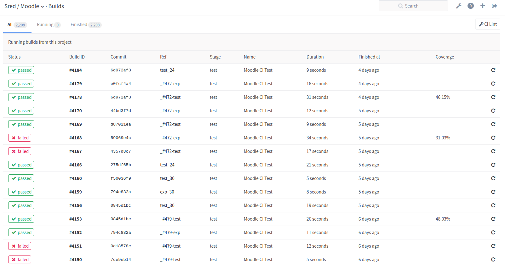

---

## A single build

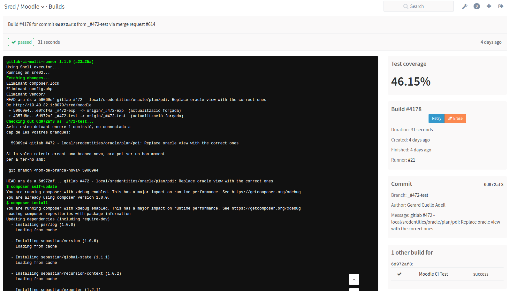

---

## A merge request


---

## Enabling code coverage

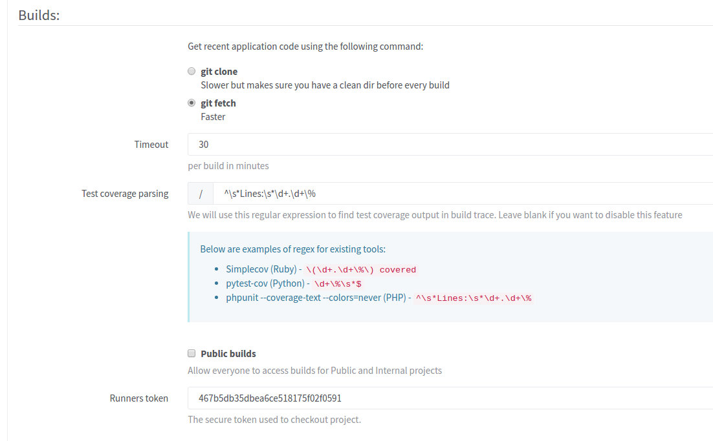

----

# But... How?

A simple keyword

## runners

---

## A runner is

- a Gitlab's [registered client](http://doc.gitlab.com/ce/ci/runners/README.html)
- [installed on any computer](https://gitlab.com/gitlab-org/gitlab-ci-multi-runner/#install-gitlab-runner)

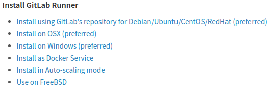

---

## A runner waits for

- requests from Gitlab to run tasks
 * unitary tests
 * integration tests
 * ...
 * whatever defined in *.gitlab-ci.yml* file.

---

## .gitlab-ci.yml

```
# This file is generated by GitLab CI
Moodle CI Test:
  script:
  - composer self-update
  - composer install
  - ./vendor/bin/phpunit -c tests/ --coverage-text --colors=never
  tags:
  except:
  - tags
```

* Stages (dev, pre-prod, prod)
* Different tasks/tests/actions per stage

---

### Runners are integrated from Gitlab

- Gitlab shows whether it was ok
- Rerun build on demand
- Depicts which computer is committing the build


---

## When installing a runner

You decide the execution type of builds

- shell
- docker
- docker-ssh
- ssh

---

## Runner types

### Shared

- Proceeding builds from any project (default)
- Tags to describe requirements (project vs. runner tags)

### Specific

- You manually assign runners to projects

----

# Demo time!

Note:
- docker start gitlab

----

# Thanks!

[@jpahullo](http://twitter.com/jpahullo/)

http://jpahullo.github.io/slides/gitlab/
