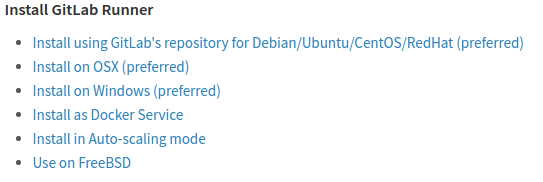
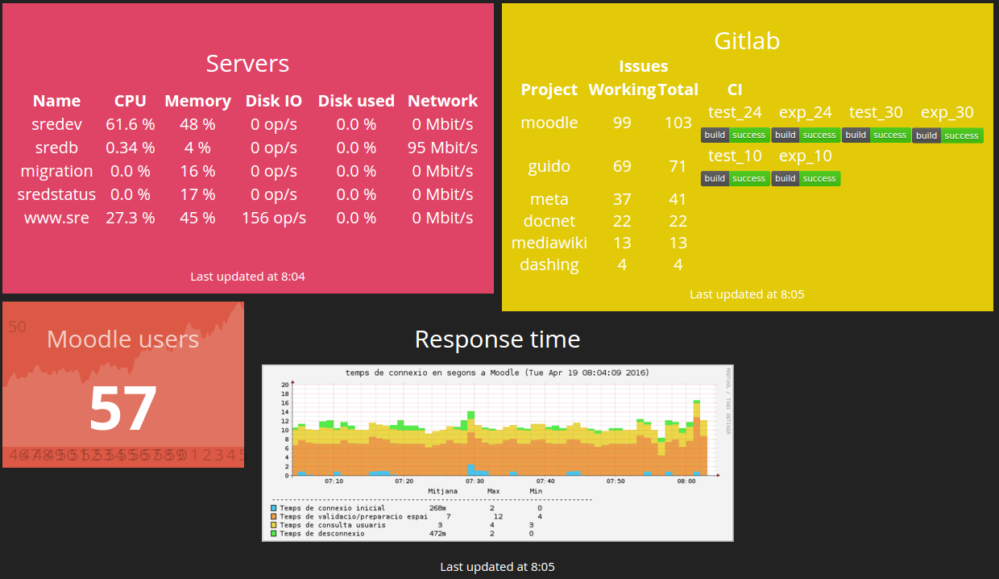

# Gitlab 8.9

*Jordi Pujol Ahulló* | [@jpahullo](http://twitter.com/jpahullo) | Working at [URV - SREd](http://www.sre.urv.cat)


[@gdgtarragona](http://twitter.com/gdgtarragona) | [GDG Tarragona](http://www.gdgtarragona.net/) 

----

# Why Gitlab?

Lots of project managers:
* Github
* Jira
* Bitbucket
* BugZilla
* Redmine
* Track
 
With wikis, issues, labels, issue's status

But we need more!

### continuous integration!

---

# Success stories

[Stack Overflow also uses Gitlab](https://about.gitlab.com/2016/04/07/stack-overflow-support-network/)


----

## Gitlab: Project manager

*Everything starts with an issue*

---

## Under the hood

GitLab is a Ruby on Rails application that runs on the following software:

* Ubuntu/Debian/RHEL
* CentOS/Scientific Linux/Oracle Linux
* Ruby (MRI) 2.1
* Git 2.7.4+
* Redis 2.8+
* MySQL or PostgreSQL

---

## gitlab.com for free 

- unlimited public projects
- unlimited private projects

---

## Community Edition (CE)

- Totally free
- No restrictions (10.000 projects)
- Not all features available

---

## Enterprise Edition (EE)

- gitlab.com version
- payment version
- full-featured

----

# Installation

- From source code
- From .deb .pkg packages
- From docker image

----

# Gitlab.com

*jpahullo/php-project*

[Project options and settings](https://gitlab.com/jpahullo/php-project)

---

### Other integrable services

[Integrable services](https://gitlab.com/jpahullo/php-project/services)

---

### DIY

http://doc.gitlab.com/ce/api/

```
curl --header "PRIVATE-TOKEN: 9koXpg98eAheJpvBs5tK" \
    "https://my.gitlab/api/v3/projects"
```

```
curl https://my.gitlab/api/v3/user?access_token=OAUTH-TOKEN
```

Or use a ruby gem [gitlab - Dec 2015](https://rubygems.org/gems/gitlab/versions/3.6.1) | [github](https://github.com/NARKOZ/gitlab)

;-)

----

## [Merge requests](https://gitlab.com/jpahullo/php-project/merge_requests/2)
## are
# powerful

* **Discussion**
* **Commits**
* **Builds**, with code coverage if enabled!
* **Changes**, ideal for peer-review.

----

# But only a project manager?

----

# Continuous Integration

- Gitlab CI integrated with Gitlab
- Per project
- Every push\* produces a build

http://doc.gitlab.com/ce/ci/README.html


---

## [List of builds](https://gitlab.com/jpahullo/php-project/pipelines)

* Pipeline: a single job from your `.gitlab-ci.yml`
* Check the status of every build
 

---

## [Enabling code coverage](https://gitlab.com/jpahullo/php-project/edit)


----

# But... How?

A simple keyword

## runners

---

## A runner is

- a Gitlab's [registered client](http://doc.gitlab.com/ce/ci/runners/README.html)
- [installed on any computer](https://gitlab.com/gitlab-org/gitlab-ci-multi-runner/#install-gitlab-runner)



---

## A runner waits for

- requests from Gitlab to run tasks
 * unitary tests
 * integration tests
 * ...
 * whatever defined in *.gitlab-ci.yml* file.

---

## .gitlab-ci.yml

```
# This file is generated by GitLab CI
Moodle CI Test:
  script:
  - composer self-update
  - composer install
  - ./vendor/bin/phpunit -c tests/ --coverage-text --colors=never
  tags:
  except:
  - tags
```

Features:
* Different build tasks for different code versions
* Stages (dev, pre-prod, prod)
* Different tasks/tests/actions per stage

---

### Runners are integrated from Gitlab

- Gitlab shows whether it was ok
- Rerun build on demand
- Depicts [which computer is committing the build](https://gitlab.com/jpahullo/php-project/builds/2378469)

---

## When installing a runner

You decide the execution type of builds

- shell
- docker
- docker-ssh
- ssh

---

## Runner types

### Shared

- Proceeding builds from any project (default)
- Tags to describe requirements (project vs. runner tags)

### Specific

- You manually assign runners to projects

----

Overall status on http://shopify.github.io/dashing/



----

What about Community Edition?

### Dockerized Gitlab CE demo!

Note:
- docker start gitlab
- root / 5iveL!fe / 12345678
- git clone ssh://git@192.168.1.2:8022/root/demo.git

----

# So...

1. **Gitlab** as a project manager (Gitlab + Gitlab CI)
2. With **continuous integration** (spotted everywhere)
3. Connected to **runners** to do automated tasks execution

----

# Thanks!

Special thanks to **GDG Tarragona**

[@jpahullo](http://twitter.com/jpahullo/)

http://jpahullo.github.io/slides/gitlab89/
